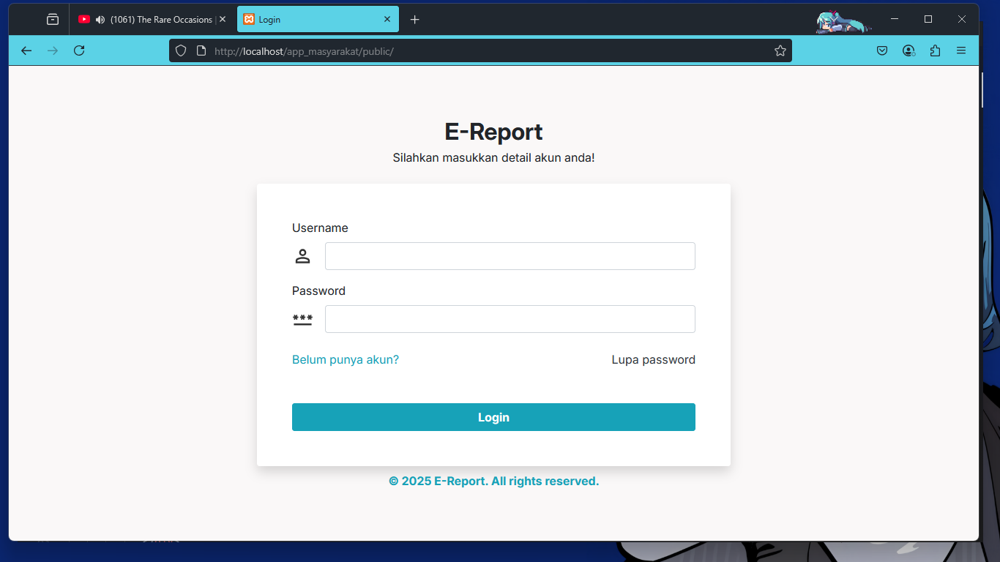
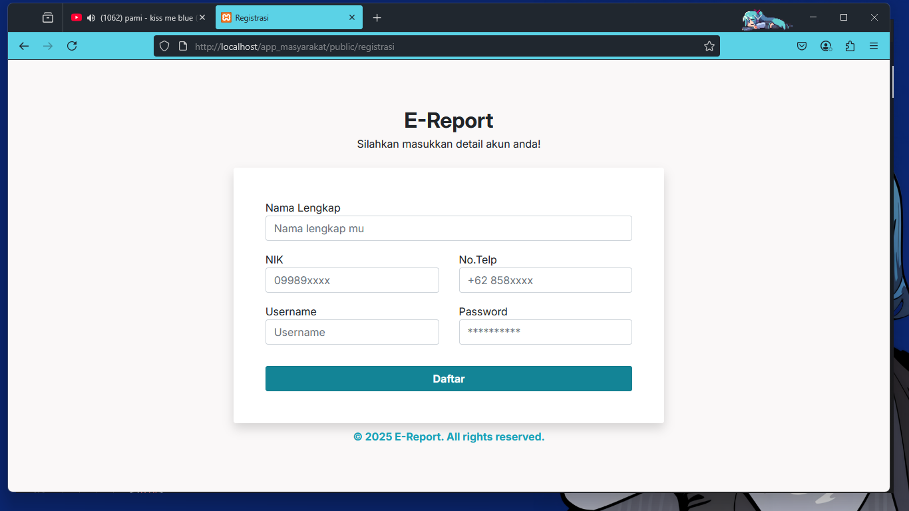
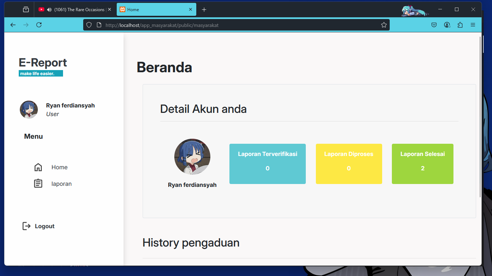
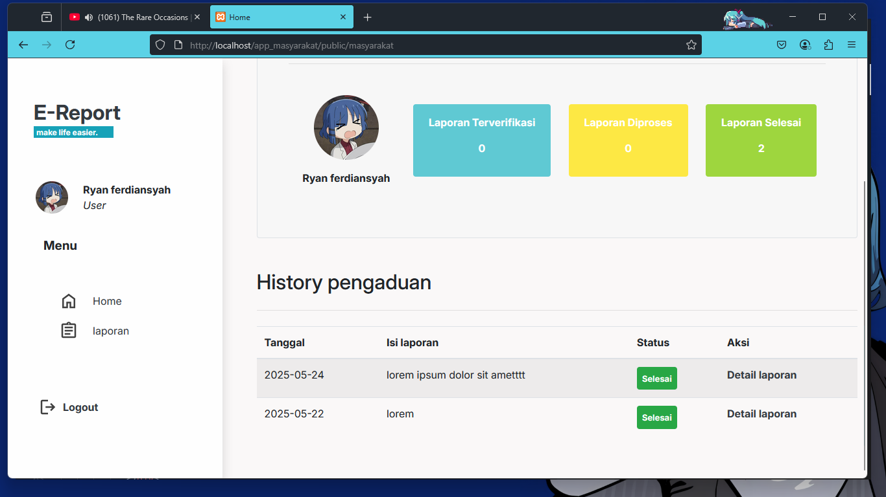
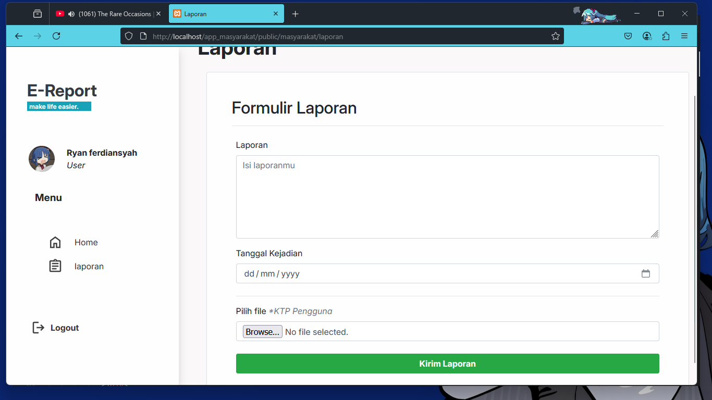
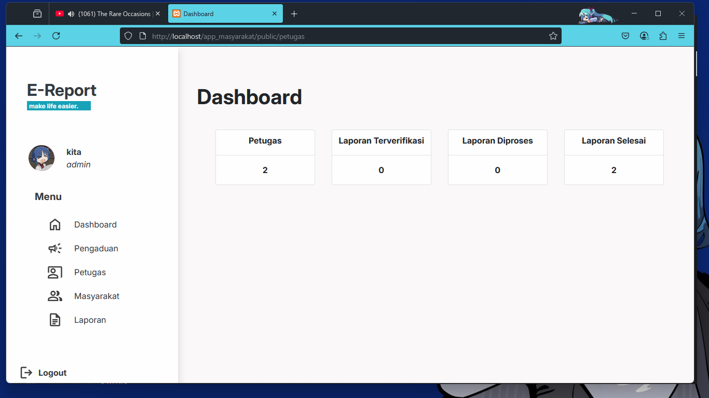
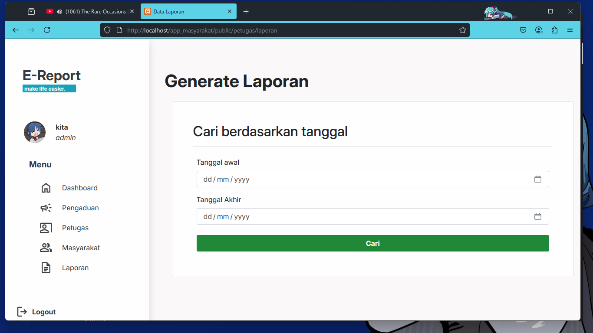
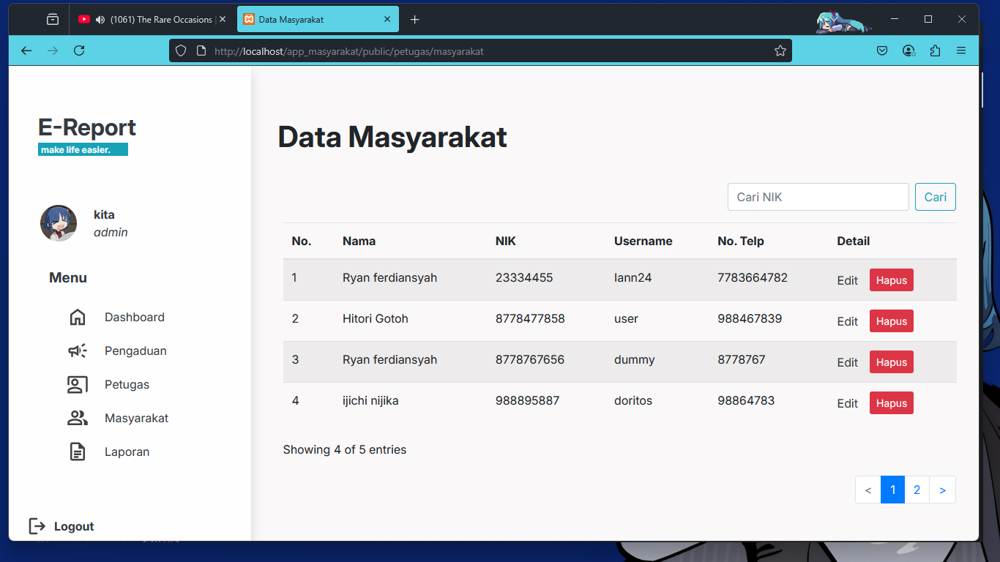
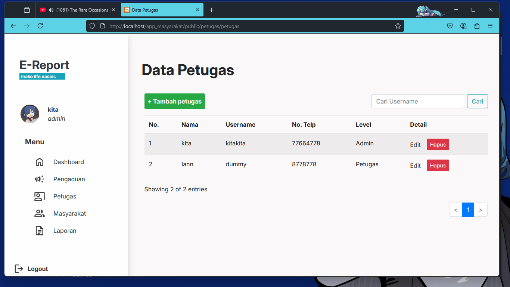
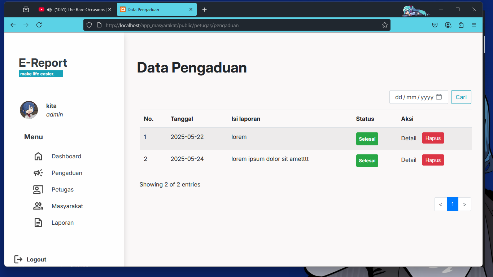

# Public complaint service website project by group 7

### Preview

Login page

Register page

Home page

Home page

Laporan(masyarakat) page

Dashboard page

List laporan page

List Masyarakat page

List Petugas page

List Pengaduan page

#### Extra
Thanks to all my partner on this project.

**Rais mujjaddid A.** as a designer of website flow and diagram

**M. Rifqi** as a designer of database

**Yoan Kavallera S** as a designer of database
